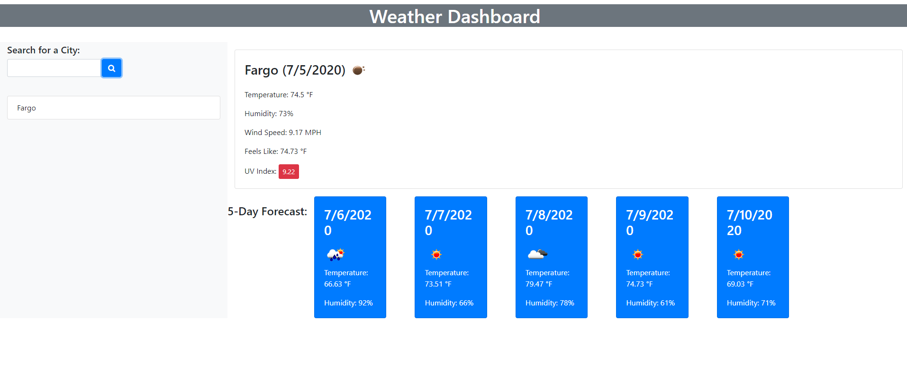

# Weather-DashBoard
## Steps and work
-Added a local storage to store previous town  
-Added function to append data pulled with server-side api  
-site works as intended  
-api key works and is used for getting 5 day, current, and uvi data  
-That data is then used and displayed on page  
link to site :https://trbergh123.github.io/Weather-DashBoard/

